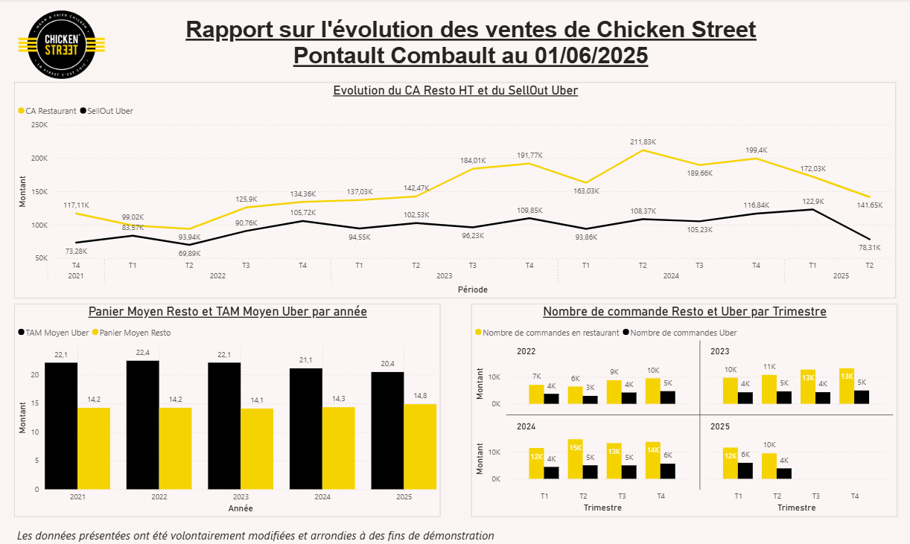

# 🍗 Chicken Street — Analyse de la performance commerciale

## 🎯 Objectif

Analyser les ventes afin d’identifier les leviers d’optimisation du chiffre d’affaires.

---

## 📊 Analyse réalisée

- Analyse du chiffre d’affaires
- Volume de commandes
- Panier moyen
- Analyse temporelle (jours, périodes)

---

## 🛠️ Outils

- Power BI
- Excel

---

## 📸 Dashboard

